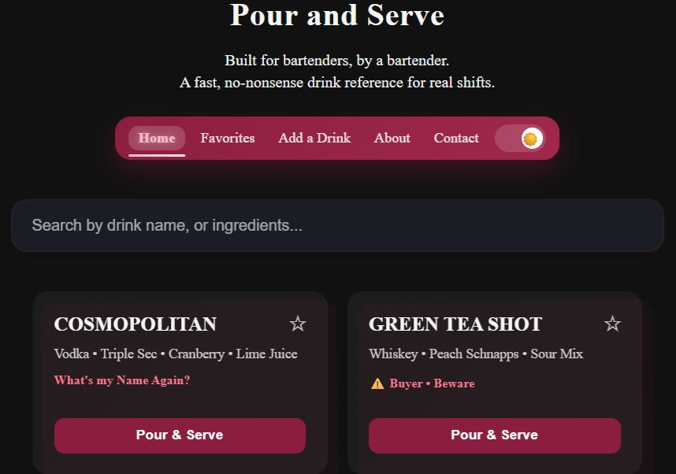

# 🍸 Pour & Serve

**A bartender-first web app built for speed, clarity, and real-world use behind the bar.**

---

## 🔥 Why I Built This

After over 10 years behind the bar, I got tired of searching for drink recipes during a shift and getting:
- slow, cluttered websites  
- inconsistent measurements  
- pages that were impossible to read in low light  

I wanted something **fast**, **clean**, and built for actual service.

So I built it.

---

## ⚡ What It Does

- 🔍 Search drinks instantly by name  
- ⭐ Save favorites for quick access  
- 📱 Mobile-first design for real bar environments  
- 🌙 Dark mode optimized for low-light use  
- ➕ Submit new drink recipes  

---

## 🧠 Key Features

- Real-time filtering (no page reloads)  
- Clean, scannable drink cards  
- Ratio-based recipes for speed and consistency  
- Favorites stored locally  
- Progressive Web App (PWA) support  

---

## 🛠️ Tech Stack

- HTML  
- CSS  
- JavaScript  
- Local Storage  
- Formspree (for submissions)  
- Service Workers (PWA)

---

## 🚀 Live App

👉 https://lisabouvier.github.io/pour-and-serve/

---

## 💡 What Makes This Different

This isn’t just a coding project.

It’s built from **real-world experience**.

Every decision — from layout to recipe format — is based on:
- speed during service  
- usability in low light  
- minimizing friction behind the bar  

---

## 🔧 Future Improvements

- 🔎 Filter by spirit (vodka, tequila, whiskey, etc.)  
- 📊 Strength/ABV indicators  
- 🧪 More advanced search & tagging  
- ☁️ Cloud sync for favorites  

---

## 👩‍💻 About Me

I’m a front-end developer with over 10 years of real-world experience behind the bar.

I build practical, usable tools designed for real environments — not just demos.

---

## 📬 Contact

If you’d like to connect or collaborate:

📧 lisabouvier@gmail.com

---

## ⭐ If You Like It

Give it a star on GitHub — it helps more than you think!
